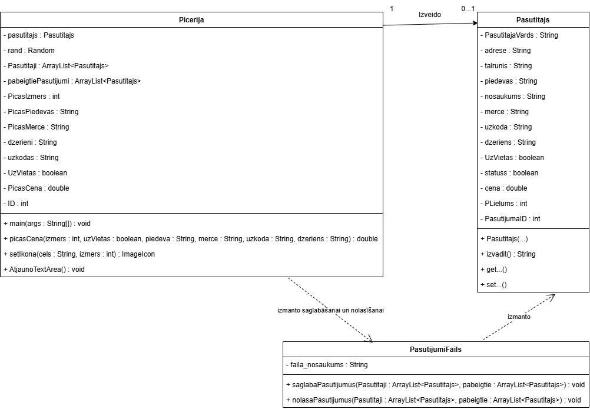
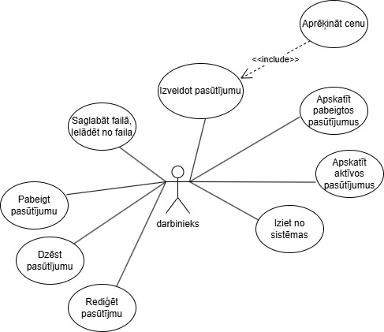
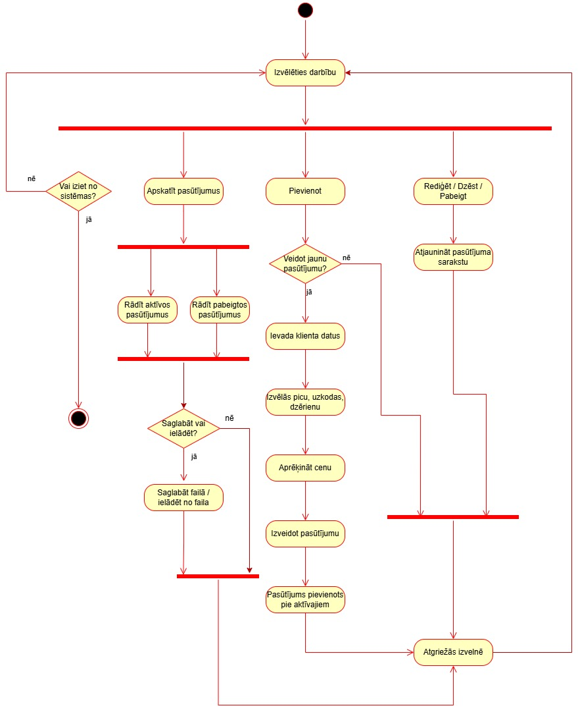
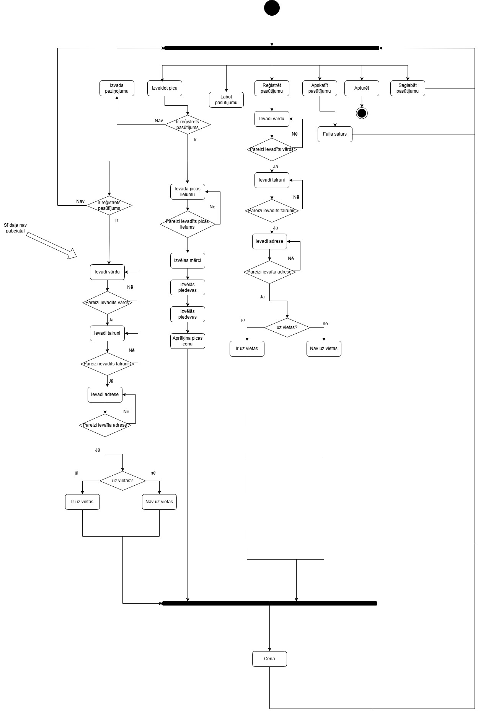
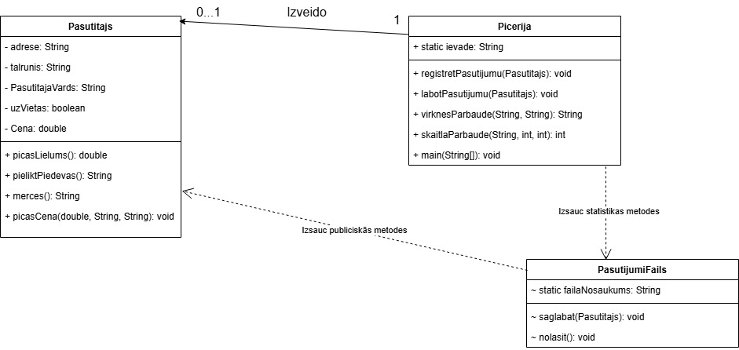
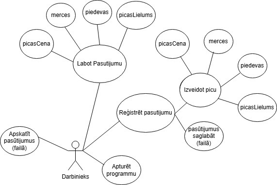
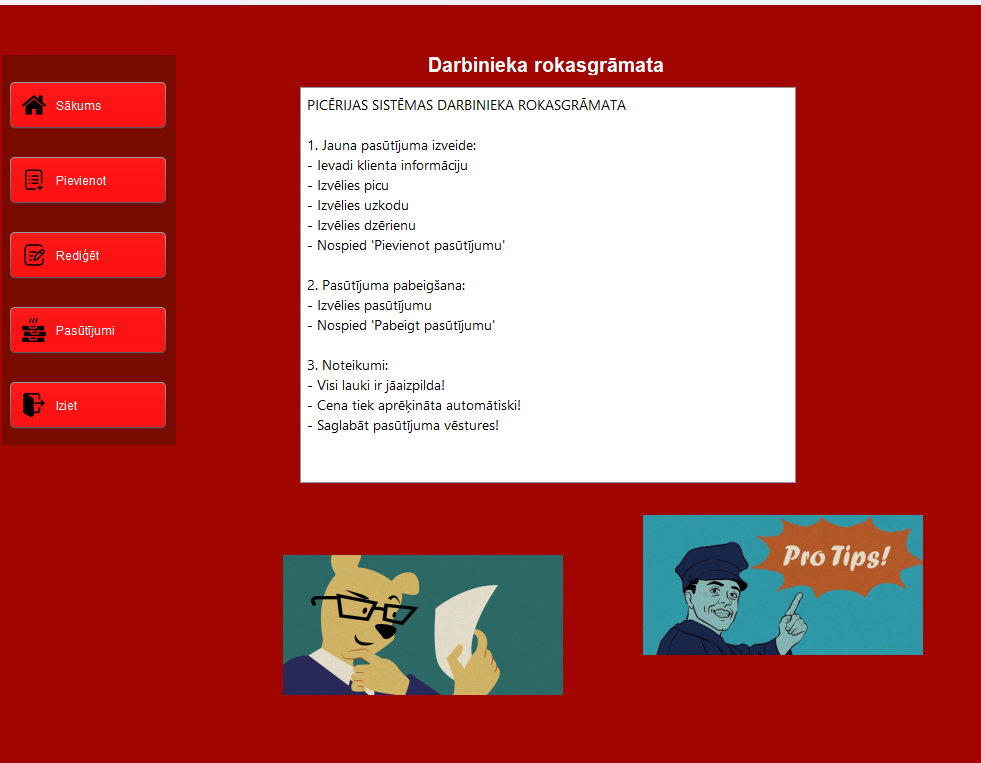
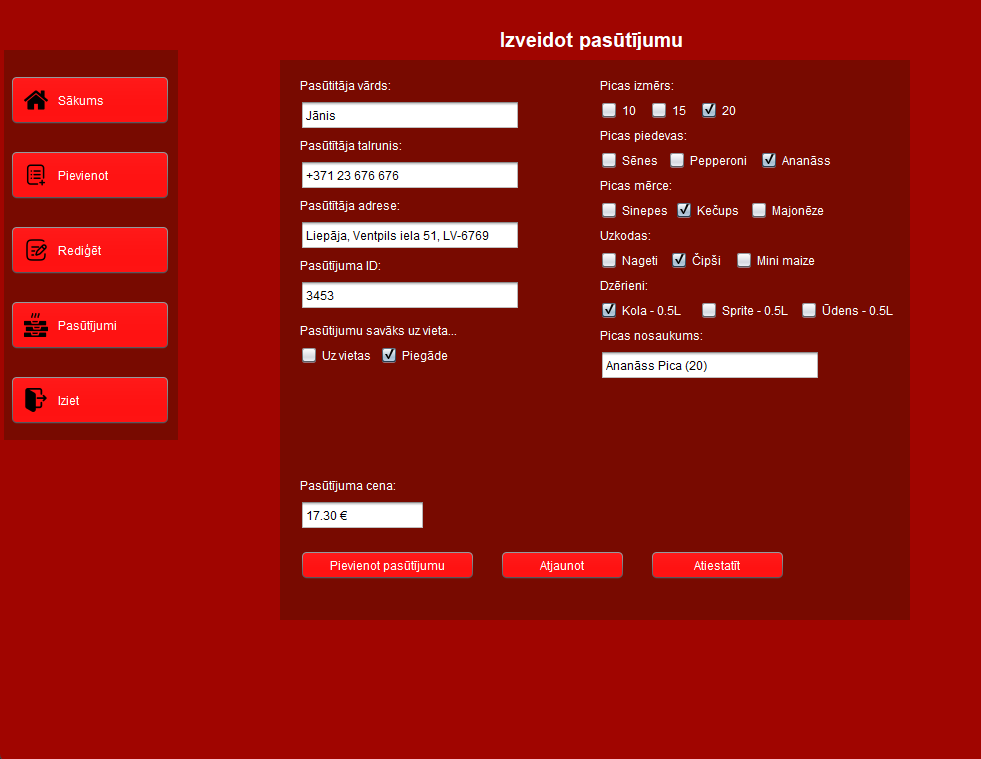
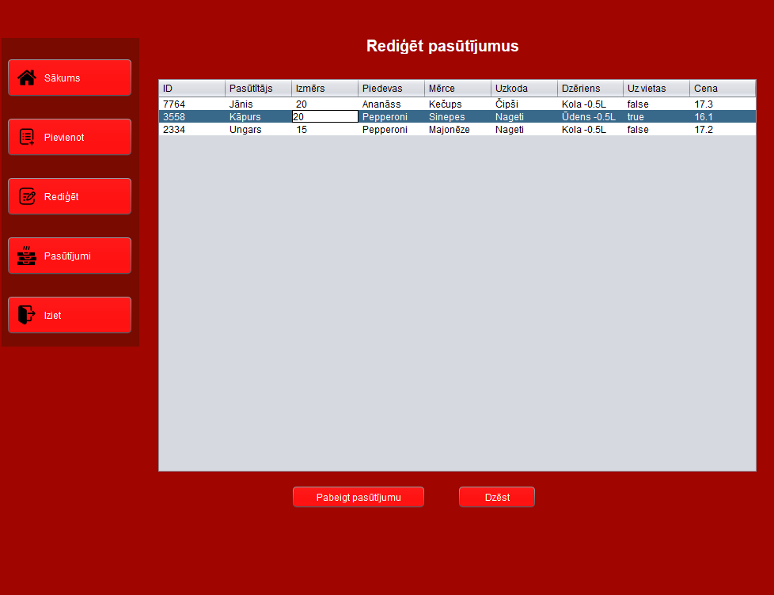
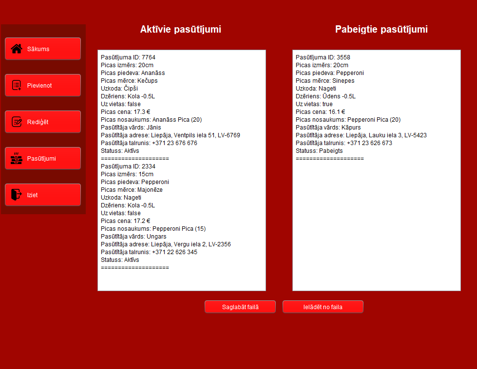

# 🍕 Picērijas pasūtījumu sistēma Java 🍕

Šī ir Java programma, kas paredzēta picērijas darbiniekiem pasūtījumu apstrādei.
Sistēma ļauj izveidot, rediģēt, dzēst un pabeigt pasūtījumus, kā arī saglabāt tos failā un ielādēt atkārtoti.

Projekts izstrādāts, kā mācību parbaudes darbs, izmantojot objektorientēto programmēšanu un UML diagrammas.

---

## Darbības, ko var veikt programma un kas tajā ir

- Jauna pasūtījuma izveide
- Automātiska cenas aprēķināšana
- Darbinieku rokasgrāmata
- Pasūtījumu rediģēšana
- Pasūtījumu dzēšana
- Pasūtījuma pabeigšana
- Aktīvo un pabeigto pasūtījumu apskate
- Datu saglabāšana failā
- Datu ielāde no faila
- Grafiska lietotāja saskarne (GUI)

---

## Programma taisīta ar:

- Java 21+
- Java Swing (GUI)
- OOP (Objekta-orientēta programmēšana)
- UML (Class, Use Case, Activity diagrammas)

---

## UML Diagrammas, pēc kā programma ir balstīta

### Class Diagram
Klašu struktūru un attiecības starp tām.

---

### Use Case Diagram
Kā darbinieks mijiedarbojas ar sistēmu.

---

### Activity Diagram
Programmas darbības plūsma.

---

### Vecās diagrammas
Vecās UML diagrammas.

---

## Programmas screenshots

### Sākuma logs

### Pasūtījuma izveide

### Pasūtījumu rediģēšana

### Pasūtījumu saraksts

---

## Kā palaist projektu

1. Lejupielādē jar failu caur Releases
2. Atver to (Nepieciešama instalēta java)
3. Programma atvērsies!

---

## Autors

Emīls Smirnovs 2PT.
